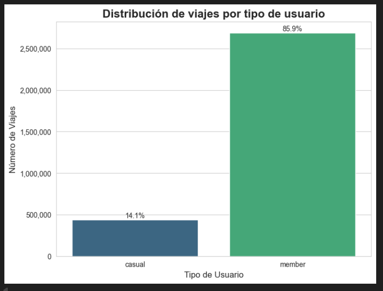
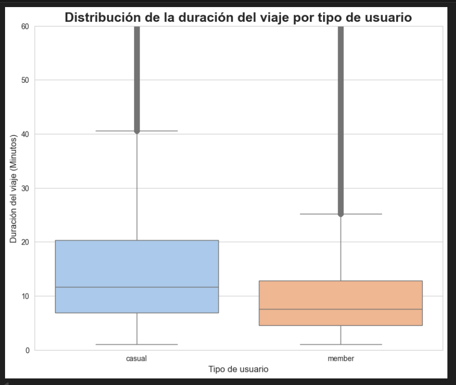
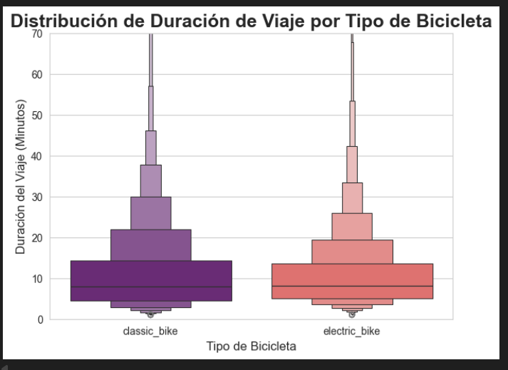
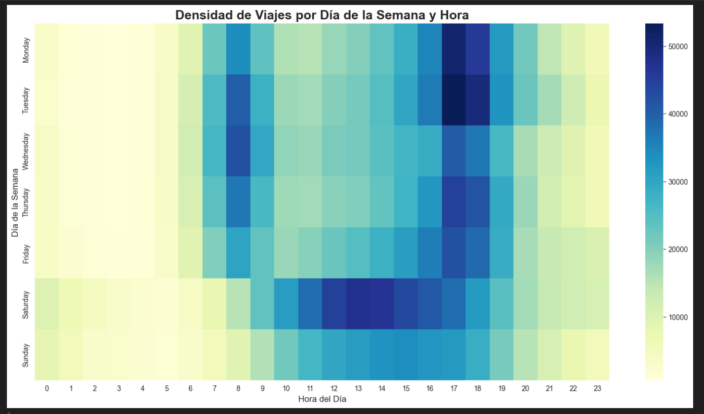
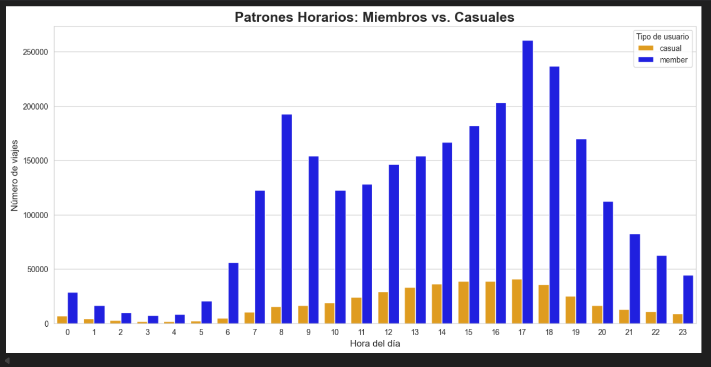
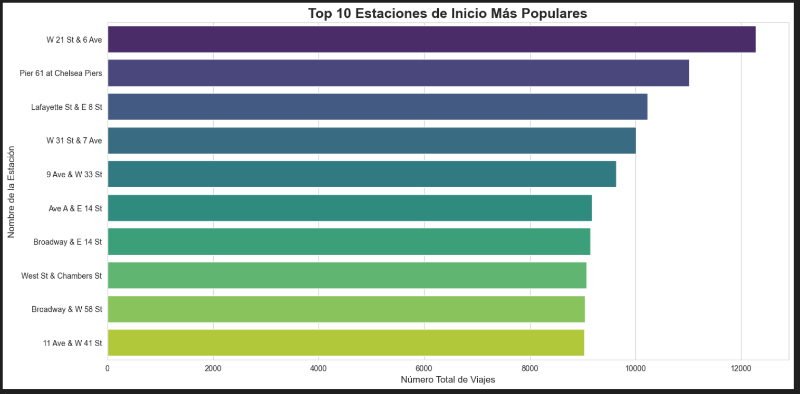
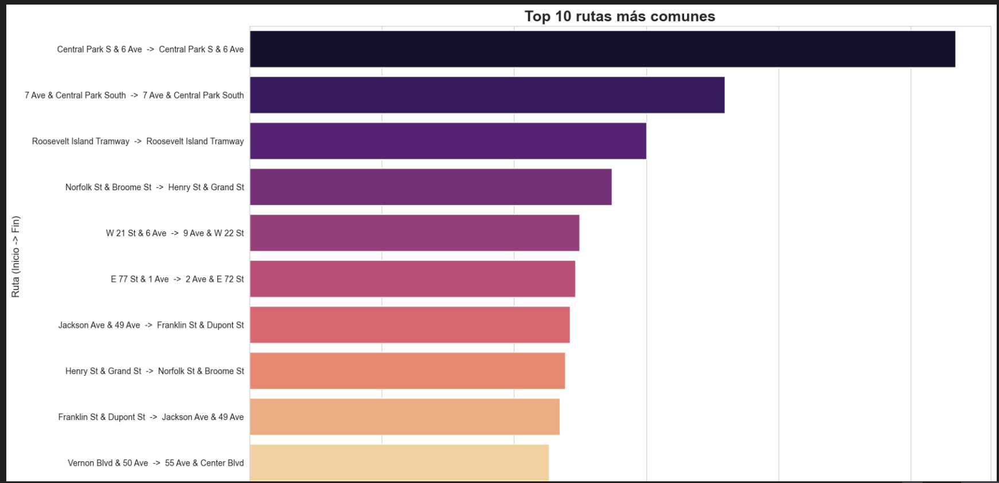
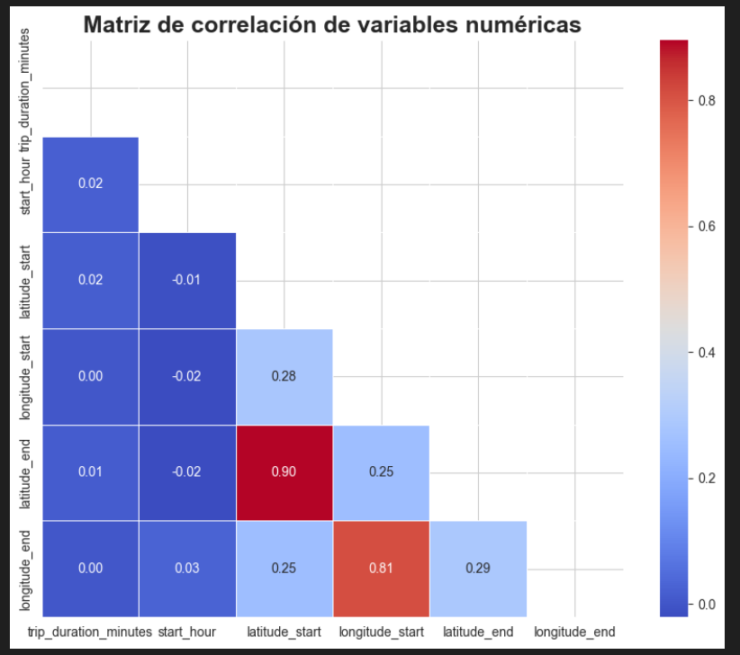
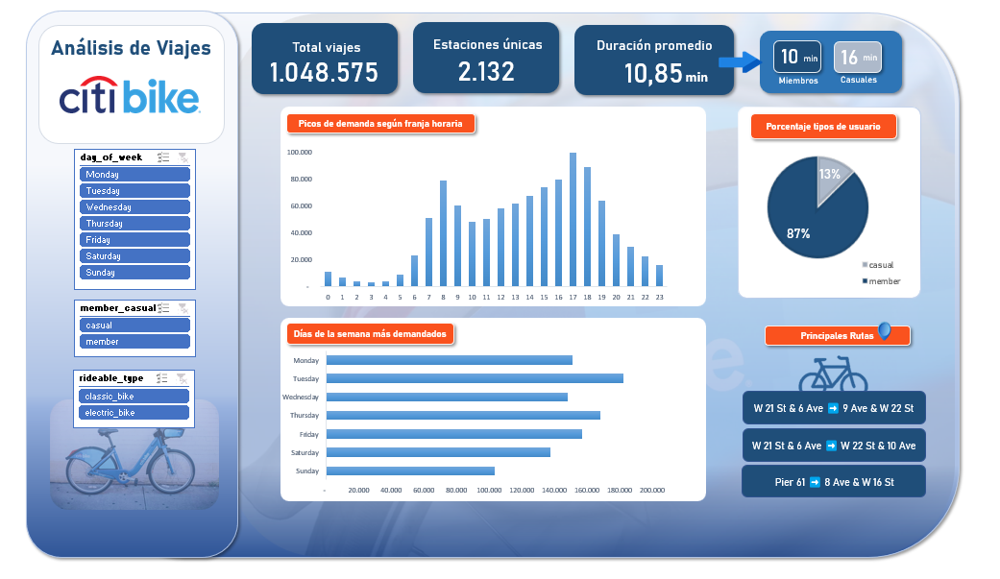

# **Análisis Exploratorio de Datos y Dashboard del Sistema Citi Bike de Nueva York**

Autor: Adriana Blanco

Fecha: septiembre 2025

**Proyecto: Proyecto final del Máster en Data Analytics**

-----------------------------------
## 1. **Resumen del Proyecto**
   
Este proyecto presenta un análisis exploratorio de datos (EDA) exhaustivo sobre el uso del sistema de bicicletas compartidas Citi Bike en Nueva York. A partir de datos brutos de viajes y estaciones, se ha ejecutado un pipeline de datos completo que incluye la limpieza, transformación y enriquecimiento de la información. El análisis posterior, que combina técnicas descriptivas, estadísticas y de visualización, ha permitido identificar patrones de uso clave, segmentar el comportamiento de los usuarios y determinar los epicentros geográficos de la demanda.

Los hallazgos principales se han consolidado en un dashboard operativo e interactivo en Excel, diseñado para facilitar la toma de decisiones estratégicas. El análisis concluye que el sistema sirve a dos perfiles de usuario distintos (miembros para "commuting" y casuales para ocio) con patrones temporales y geográficos muy definidos, lo que ofrece oportunidades claras para la optimización de operaciones y marketing.

-----------------------------------

## 2. **Objetivos del proyecto**
   
El objetivo principal se centra en transformar datos brutos en insights accionables, respondiendo a las siguientes preguntas de negocio:

¿Cuál es el perfil general de uso del servicio?

¿Existen diferencias de comportamiento entre los usuarios miembros y los casuales?

¿Cuáles son los patrones de demanda temporales (diarios, semanales)?

¿Dónde se concentra geográficamente la demanda de bicicletas?

¿Qué relaciones existen entre las variables numéricas como la duración, la hora y la ubicación de los viajes?

-----------------------------------

## 3. **Metodología y herramientas**
   
El proyecto se ha desarrollado siguiendo un flujo de trabajo estándar de análisis de datos:

* **Obtención y carga de datos:** Extracción de datos de múltiples fuentes.

* **Limpieza y transformación (ETL):** Procesamiento de los datos para asegurar su calidad y coherencia.

* **Análisis Exploratorio de Datos (EDA):** Investigación de los datos mediante estadísticas y visualizaciones.

* **Creación de Dashboard:** Presentación de los hallazgos en una herramienta interactiva.

* **Generación de informe:** Documentación del proceso y las conclusiones.

-----------------------------------

**Herramientas utilizadas:**

* Análisis y ETL: Python, Jupyter Notebook, Pandas, NumPy.
  
* Visualización (en Python): Matplotlib, Seaborn, Geopandas.
  
* Dashboard: Microsoft Excel (Tablas Dinámicas, Gráficos Dinámicos, Slicers).

-----------------------------------

## 4. **Proceso de Datos (ETL)**
   
4.1. Fuentes de Datos

Se utilizaron dos conjuntos de datos distintos:

* Datos de viajes: Archivos .csv con registros de viajes individuales, obtenidos de www.kaggle.com.
  
* Datos de estaciones: Información de las estaciones (ID, nombre, coordenadas) obtenida de la fuente de datos oficial en vivo para asegurar la máxima actualidad.

4.2. Limpieza y Transformación

El proceso de limpieza fue exhaustivo para garantizar la calidad del dataset final:

* Combinación de archivos: Se unificaron múltiples archivos de viajes en un único DataFrame.

* Gestión de tipos de datos: Se corrigieron los dtypes para permitir cálculos correctos, especialmente con fechas (datetime) y categorías (category).

* Unión de datos: Se enriquecieron los datos de viajes con la información de las estaciones. *Se diagnosticó una incompatibilidad entre los sistemas de station_id, por lo que se tomó la decisión analítica de realizar la unión utilizando station_name tras un proceso de limpieza de texto (.strip()).*

* Filtrado lógico: Se eliminaron los viajes atípicos (duración menor a 1 minuto o mayor a 24 horas) y los registros duplicados basados en el ride_id para evitar distorsiones en el análisis. También se eliminaron columnas que no aportaban información relevante para el analisis.

4.3. Creación de nuevas características

Se crearon nuevas columnas para facilitar el análisis:

* trip_duration_minutes: Duración del viaje en minutos.

* start_hour: Hora de inicio del viaje.

* day_of_week: Día de la semana del viaje.

* month: Mes del viaje.

-----------------------------------

## 5. **Análisis Exploratorio y Hallazgos Clave**
   
5.1. Perfil y comportamiento de usuario

Conclusión: El sistema es utilizado mayoritariamente por miembros (86%), lo que indica una fuerte base de clientes recurrentes.

Evidencia: El análisis de la duración de los viajes (boxplot) revela que los usuarios casuales realizan viajes significativamente más largos y variables, sugiriendo un uso orientado al ocio, mientras que los miembros realizan viajes más cortos y consistentes, propios del "commuting". Además se observa que la mediana de duración de los viajes en bicicleta eléctrica (8.15 minutos) es mayor que la de las bicicletas clásicas (7.84 minutos). Esa pequeña pero consistente diferencia, multiplicada por millones de viajes, confirma el patrón de comportamiento: la gente usa las bicicletas eléctricas para hacer trayectos un poco más largos.

5.2. Patrones temporales

Conclusión: El uso del servicio sigue dos patrones diarios claramente diferenciados.

Evidencia: Estos dos gráficos muestran un patrón de "commuting" entre semana, con picos de demanda a las 8 a.m. y 5 p.m. impulsados por los miembros. Durante el fin de semana, el patrón cambia a uno de ocio, con una demanda concentrada y sostenida desde el mediodía hasta la tarde, liderada por los usuarios casuales.

5.3. Análisis geoespacial

Conclusión: La demanda está fuertemente concentrada en el corazón de Manhattan.

Evidencia: El gráfico de las 10 estaciones más populares muestra que los "puntos calientes" se sitúan en Midtown Manhattan, alrededor de centros de negocios, nudos de transporte y zonas de ocio como Central Park. Además, el análisis de las rutas más populares revela la existencia de viajes circulares con inicio y fin en la misma estación, confirmando el uso recreativo en zonas de parques.

5.4. Análisis estadístico

Conclusión: Los viajes son geográficamente locales, y la duración es independiente de la hora o la ubicación.

Evidencia: La matriz de correlación muestra una fuerte correlación positiva (>0.8) entre las coordenadas de inicio y fin, validando la naturaleza local de los trayectos. A su vez, la correlación casi nula entre la duración, la hora y las coordenadas indica que estas variables son independientes.

-----------------------------------

## 6. **Dashboard operativo en Excel**
   
Se ha desarrollado un dashboard interactivo en Excel que consolida los hallazgos principales.

Componentes:

* KPIs Dinámicos: Muestran en tiempo real el total de viajes, la duración promedio (general y por tipo de usuario) y el número de estaciones, actualizándose según los filtros aplicados.

* Filtros interactivos (Slicers): Permiten segmentar todo el dashboard por día de la semana, tipo de usuario y tipo de bicicleta.
  
* Visualizaciones clave: Incluye gráficos de barras, circulares y de texto que presentan los análisis de patrones temporales, de usuario y de rutas más populares.

-----------------------------------

## 7. **Conclusiones y recomendaciones de negocio**
   
* Segmentación de marketing: Dado el claro perfil de ocio de los usuarios casuales, se recomienda crear campañas de marketing específicas para turistas (pases diarios, rutas recomendadas) y promocionarlas en las estaciones cercanas a parques y puntos de interés.
  
* Optimización de operaciones: La empresa debe planificar el reequilibrio de bicicletas basándose en los dos patrones de demanda: reforzar la disponibilidad en distritos de oficinas durante las horas punta de los días laborables y en zonas de ocio durante el mediodía de los fines de semana.
  
* Gestión de la flota: El análisis demuestra que las bicicletas eléctricas se usan para viajes más largos. Se recomienda aumentar su disponibilidad en estaciones que son puntos de partida de las rutas recreativas más populares.

-----------------------------------

## 8. **Estructura del Repositorio**
   
/data/: Contiene los datasets brutos y procesados. Debido a su elevado tamaño, se precisa descargar en el siguiente enlace [Dataset](https://drive.google.com/drive/folders/1eYg0GjoU0vn4PW7DkdBGfIgYvUYH4rei?usp=drive_link) 

/Notebooks/: Contiene los cuadernos de Jupyter con todo el proceso de exploración, limpieza y análisis.

/dashboard/: Contiene el archivo final de Excel con el dashboard operativo. Necesario descargar en el siguiente enlace[Dashboard](https://drive.google.com/drive/folders/1HXElsvJg10hyON47JMm9_ko03PBcuxh?usp=drive_link)  

/images/: Contiene las imágenes del utlizadas para el informe

README.md: Resumen y guía del proyecto.

INFORME_ANALISIS.md: Este informe detallado.
